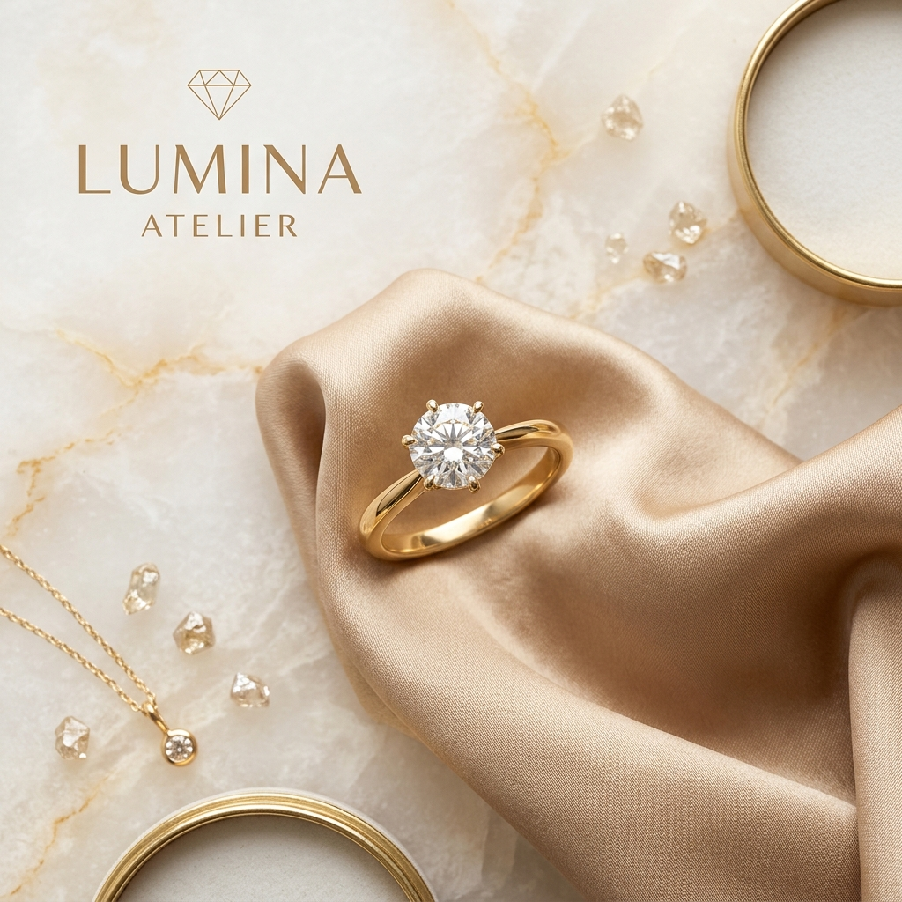

# Lumina Atelier | Brand Identity & Asset Pack

This document outlines the brand guidelines, color palettes, typography, and visual assets of **Lumina Atelier**—a high-end, responsive luxury jewelry shopping experience.

---



---

## 1. Brand Essence & Positioning

*   **Brand Statement**: *"Timeless elegance, crafted for your moments."*
*   **Mission**: Lumina Atelier bridges heritage Italian goldsmithing with contemporary luxury. We specialize in ethically-sourced, conflict-free solitaire and pavé diamond rings designed to highlight modern, architectural cuts.
*   **Tone**: Sophisticated, minimalist, warm, and premium.

---

## 2. Visual Palette (Color Tokens)

The Lumina Atelier design system utilizes a curated alabaster and warm gold color theme. Use these styling tokens in CSS and graphic designs:

| Color Token | Variable Name | Hex Code | Visual Role |
| :--- | :--- | :--- | :--- |
| **Alabaster Cream** | `--color-bg-base` | `#FDFBF7` | Primary background, airy and high-end feel |
| **Champagne Accent** | `--color-bg-accent` | `#F4EFE6` | Secondary background, card backing, structure |
| **Elegant Warm Gold** | `--color-gold` | `#C5A880` | Accent elements, badges, primary buttons, borders |
| **Gold Hover State** | `--color-gold-hover` | `#AF9065` | Hover/active states for gold components |
| **Soft Gold Tint** | `--color-gold-light` | `#F7F3EB` | Carousel backings, hero background overlays |
| **Luxury Charcoal** | `--color-text-primary` | `#1F1C1B` | Primary titles, body text, sticky buttons |
| **Muted Warm Gray** | `--color-text-secondary`| `#6B625E` | Subtitles, product descriptions, secondary links |
| **Subtle Warm Border** | `--color-border` | `#EAE3D5` | Card outlines, accordion lines, nav dividers |

---

## 3. Typography Guidelines

Typography is split into high-contrast pairings: a classic editorial serif for headings, and a clean sans-serif for numbers, buttons, and descriptions.

### Primary Serif (Headings & Titles)
*   **Font Family**: `Playfair Display`, Georgia, serif
*   **Font Weights**: `500` (Medium), `600` (Semi-bold)
*   **Styling**: Spaced out `letter-spacing: 0.03em` for headers. Used for `h1`, `h2`, `h3`, `h4`, and brand logo subtitles.

### Secondary Sans-Serif (Body & Actions)
*   **Font Family**: `Inter`, system-ui, sans-serif
*   **Font Weights**: `300` (Light), `400` (Regular), `500` (Medium), `600` (Semi-bold)
*   **Styling**: Used for body copy, sizes, prices, buttons, and navigation links.

---

## 4. Logo Design & Typography

The Lumina Atelier logo lockup is purely text-based and styled via CSS, reflecting a high-end luxury editorial look.

```
L U M I N A
A t e l i e r
```

### CSS Representation
```css
.nav-logo {
  font-family: 'Playfair Display', serif;
  font-size: 1.8rem;
  font-style: italic;
  font-weight: 600;
  letter-spacing: 0.05em;
  color: #1F1C1B;
}

.nav-logo span {
  font-family: 'Inter', sans-serif;
  font-size: 0.7rem;
  font-weight: 500;
  text-transform: uppercase;
  letter-spacing: 0.3em;
  color: #C5A880;
}
```

---

## 5. Ring Collection Directory

Below are the 10 core rings pre-packaged in the Lumina Atelier product catalog, mapped to the custom high-quality uploaded images:

1.  **Gold Solitaire Diamond Ring**
    *   *Path*: `images/Gemini_Generated_Image_qiugelqiugelqiug.png`
    *   *Details*: Round solitaire diamond in an 18k yellow gold band.
2.  **Platinum Diamond Halo Ring**
    *   *Path*: `images/Gemini_Generated_Image_qiugelqiugelqiug (1).png`
    *   *Details*: Round-cut diamond framed by a micro-pavé halo on a platinum band.
3.  **Gold Three-Stone Ring**
    *   *Path*: `images/Gemini_Generated_Image_qiugelqiugelqiug (2).png`
    *   *Details*: Past, present, and future diamonds on an 18k yellow gold band.
4.  **Platinum Pavé Diamond Band**
    *   *Path*: `images/Gemini_Generated_Image_qiugelqiugelqiug (3).png`
    *   *Details*: Half-eternity wedding band with three rows of pavé-set diamonds.
5.  **Gold Eternity Diamond Ring**
    *   *Path*: `images/Gemini_Generated_Image_qiugelqiugelqiug (4).png`
    *   *Details*: Solid 18k yellow gold eternity band with a continuous diamond circle.
6.  **Marquise Cut Solitaire Ring**
    *   *Path*: `images/Gemini_Generated_Image_qiugelqiugelqiug (5).png`
    *   *Details*: Striking marquise-cut diamond on a four-prong platinum band.
7.  **Princess Cut Solitaire Ring**
    *   *Path*: `images/Gemini_Generated_Image_qiugelqiugelqiug (6).png`
    *   *Details*: Square princess-cut diamond on a sleek 18k yellow gold band.
8.  **Cushion Cut Halo Ring**
    *   *Path*: `images/Gemini_Generated_Image_qiugelqiugelqiug (7).png`
    *   *Details*: Cushion-cut diamond with a borders-pavé diamond halo in platinum.
9.  **Vintage Filigree Bezel Ring**
    *   *Path*: `images/Gemini_Generated_Image_qiugelqiugelqiug (8).png`
    *   *Details*: Filigree gold ring featuring an octagonal bezel-set diamond.
10. **Bezel Solitaire Platinum Ring**
    *   *Path*: `images/Gemini_Generated_Image_qiugelqiugelqiug (9).png`
    *   *Details*: Contemporary round solitaire diamond in a protective platinum bezel.

---

## 6. Dynamic Visual Asset Guidelines

To ensure visual consistency when adding new products through the **Admin Product Builder**:
*   **Aspect Ratio**: Use square (`1:1`) images.
*   **Lighting & Styling**: Choose images with neutral, desaturated, or bright cream studio backgrounds (`#F4EFE6` or `#FDFBF7`) to fit the site's alabaster framing.
*   **Dynamic CSS Fail-Safe**: If no custom image is supplied, the site automatically renders a gold-accented placeholder displaying the product name initials (e.g. "VS" for Vintage Solitaire) to maintain premium spacing.
